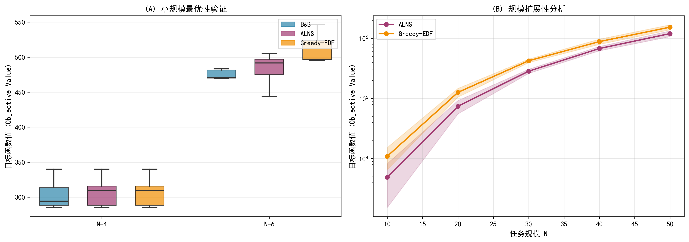
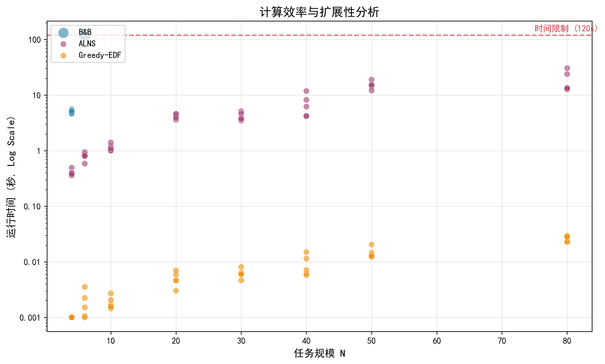
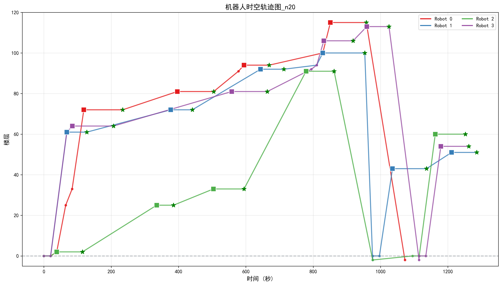
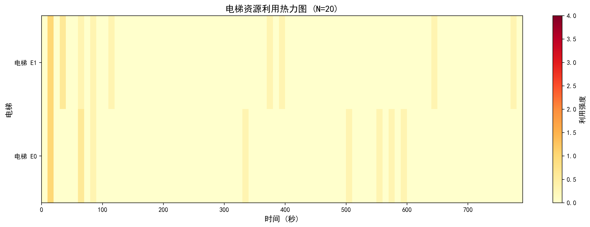

<div align="center">

# PAFC Vertical Logistics Scheduler

**Adaptive scheduling for robot fleets sharing constrained elevators in a 118-floor tower.**

`Python` · `ALNS` · `Greedy-EDF` · `Branch and Bound`

</div>

<p align="center">
  
</p>

The scheduler models a fleet of delivery robots competing for two capacity-limited elevators while respecting deadlines, battery constraints and vertical travel costs. It compares a fast baseline, an adaptive metaheuristic and an exact method for small-instance validation.

## Headline result

Across five 10-task simulations using seeds `201–205`, ALNS achieved a **55.1% lower mean composite scheduling objective** than Greedy-EDF.

| Algorithm | Mean composite objective |
| --- | ---: |
| **ALNS** | **4,915.4** |
| Greedy-EDF | 10,958.7 |

The objective combines completion time, energy and lateness penalties. The experiment used five robots, two elevators with capacity four, and fixed objective weights of `1 / 100 / 50`.

## What is implemented

| Method | Purpose | Implementation |
| --- | --- | --- |
| Greedy-EDF | Fast earliest-deadline-first baseline | `algorithms/greedy.py` |
| ALNS | Adaptive destroy-and-repair search over 500 iterations | `algorithms/alns.py` |
| Branch and Bound | Exact reference for small instances | `algorithms/branch_bound.py` |

The scheduling core uses only the Python standard library. NumPy, SciPy and Matplotlib are needed for analysis and publication figures, not for the algorithms themselves.

## Scaling behaviour

<p align="center">
  
</p>

- **4 tasks:** Branch and Bound proves the optimum; ALNS reproduces it on three of five seeds and remains within 5.1% on the other two.
- **6 tasks:** Exact search reaches its 120-second limit, marking the point where heuristic search becomes necessary.
- **80 tasks and 40 robots:** ALNS still returns complete schedules, while deadline pressure reduces the on-time completion rate to 10–24%.

<table>
<tr>
<td width="50%"></td>
<td width="50%"></td>
</tr>
</table>

## Reproduce the experiments

Python 3.10+ is sufficient for the scheduler. Install the optional analysis dependencies to regenerate figures and tables:

```bash
pip install -r requirements.txt
```

```bash
python main.py 2                    # scalability study, N = 10–50
python main.py 1                    # exact-reference study on small instances
python generate_paper_plots.py      # regenerate publication figures
python generate_tables.py          # regenerate result tables
```

Run the commands from the repository root. Seeded experiment results are written to `outputs/results/` as JSON, while publication-ready figures are stored in `outputs/paper/`.

## Repository structure

```text
algorithms/              Greedy-EDF, ALNS and Branch-and-Bound
core/                    entities, constraints, simulator and configuration
utils/                   experiment and reporting helpers
outputs/results/         committed experiment records
outputs/paper/           generated figures
main.py                  experiment entry point
```

## Project context

Independently designed and implemented as a vertical-logistics optimisation project. Exact search is used only where it can finish; the main comparison evaluates how ALNS behaves once the search space moves beyond that range.

## License

Released under the [MIT License](LICENSE).
